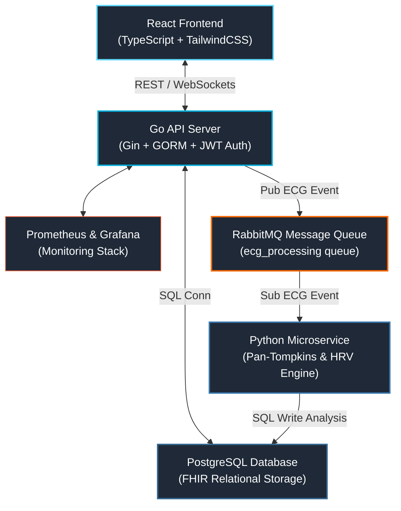

# CardioTrack: A FHIR-Inspired Event-Driven Clinical Platform

[](https://go.dev/)
[](https://www.python.org/)
[](https://react.dev/)
[](https://www.docker.com/)

**CardioTrack** is a production-grade, full-stack clinical monitoring and decision support platform engineered for cardiological patient management. Built around the internationally recognized **HL7 FHIR R4 standard** for healthcare data interoperability, the platform models medical data into robust, standardized structures. 

The system leverages a high-performance **microservice and event-driven architecture** to handle compute-intensive digital signal processing (ECG analysis) asynchronously, paired with real-time WebSocket streaming for continuous vitals monitoring.

---

## 👥 The Team & Core Contributions

CardioTrack was engineered as a collaborative effort requiring deep infrastructure design and specialized biomedical domain knowledge:

* **Athanasios Chouliaras** – *Biomedical Engineering & Frontend Architecture*
    * Designed and implemented the Python-based biomedical signal processing pipeline.
    * Developed the algorithmic implementations for **Pan-Tompkins R-peak detection**, **Heart Rate Variability (HRV)** analysis, and clinical risk stratification using the **HEART Score**.
    * Architected the **React/TypeScript** frontend layer, including high-frequency medical data visualizations using D3.js and Recharts.
* **Victor Politakis** – *Core Backend & Infrastructure Engineering*
    * Architected the **Go (Gin) production-grade monolithic API server** and relational database modeling using GORM.
    * Engineered the **Event-Driven messaging backbone** with RabbitMQ for decoupling intensive analytical tasks.
    * Implemented full **system observability** (Prometheus + Grafana), advanced multi-role Role-Based Access Control (RBAC), and orchestrated the automated CI/CD deployment pipelines.

---

## 🏗️ System Architecture



The platform relies on a decoupled, microservices-inspired architecture designed to remain highly performant under heavy analytical loads:
1. **Frontend (React + TS):** Captures multi-source metrics, streams live vitals via WebSockets, and renders advanced time-series and wave analytics.
2. **Core Gateway Engine (Go/Gin):** Serves as the secure REST and WebSocket entrypoint, enforcing RBAC, managing transactional data in PostgreSQL, and publishing heavyweight processing payloads to message queues.
3. **Broker (RabbitMQ):** Manages a persistent asynchronous processing pipeline (`ecg_processing` queue).
4. **Biomedical Analytics Service (Python):** A specialized data-science container dedicated to running production-validated medical signal workflows, updating records directly via localized database channels.

---

## 🫀 Core Biomedical Layer & Features

### 1. Advanced ECG Signal Processing Pipeline
When a diagnostic ECG file is uploaded, the Go API stores the file metadata with a `pending` state and instantly fires an async notification message into RabbitMQ, returning an efficient `202 Accepted` to the client. The Python service consumes the event and triggers a strict numerical pipeline:

* **Pan-Tompkins R-Peak Detection (1985):** The gold-standard clinical algorithm implemented utilizing `SciPy` and `NeuroKit2`. Raw waves pass through:
    1. *Bandpass Filtering (5-15 Hz)* to strictly isolate the QRS complex.
    2. *First-order Derivative* processing to highlight steep slopes.
    3. *Squaring Function* to exponentially emphasize peak voltage changes.
    4. *Moving Window Integration (150ms)* for signal smoothing prior to adaptive threshold peak detection.
* **Heart Rate Variability (Strain) Evaluation:** Calculates key time-domain clinical markers from filtered R-R intervals:
    * `SDNN`: Measures global autonomic nervous system variability.
    * `RMSSD`: Quantifies parasympathetic (vagal) activation patterns.
    * `pNN50`: Extracts the percentage of consecutive intervals fluctuating over 50ms.
* **Validation:** The algorithm is validated against the industry-standard **MIT-BIH Arrhythmia Database** (PhysioNet).

### 2. Clinical Decision Support: HEART Score Stratification
Integrates an automated tracking wizard evaluating acute chest pain for Major Adverse Cardiac Events (MACE), referenced directly against the validated *Six et al. (2010)* clinical literature. The system calculates inputs from 5 distinct criteria (History, ECG, Age, Risk Factors, Troponin), deriving precise risk profiles:
* **Low Risk (0-3):** 1-1.7% MACE probability. Suggests early discharge pathways.
* **Moderate Risk (4-6):** 12-16.6% MACE probability. Recommends inpatient observation and serial testing.
* **High Risk (7-10):** 50-65% MACE probability. Suggests emergency invasive monitoring and immediate cardiology consulting.

### 3. Real-Time Vitals Streaming (WebSockets)
A specialized WebSocket system establishes real-time persistent bindings between modern point-of-care inputs and clinical command views. Medical staff receive dynamic layout reflows and flashing toast alerts instantly when anomalous parameters (e.g., Blood Pressure $> 140/90\text{ mmHg}$) breach static target thresholds.

---

## 📊 Technical Interoperability & Database Design

Data architecture strictly shadows the **HL7 FHIR R4 schema models**, adapting normalized relational mappings for maximum standard adherence without unnecessary spec bloat:

* `Patient` Resource: Extends system user accounts to map core clinical metadata (Unique Medical Record Numbers - MRN, emergency indicators, assigned care team).
* `Observation` Resource: Stores high-frequency biometric tracking sequences (Systolic/Diastolic BP, Heart Rate, SpO2, Glucose, Cholesterol) with uniform unit representations (mmHg, bpm, %, mg/dL) and automated abnormality parsing.
* `Condition` Resource: Maps formal clinical histories utilizing standard alphanumeric **ICD-10 classification lookups**.
* `MedicationRequest` Resource: Controls drug dispensing profiles, tracking operational status limits and dosage frequencies.

---

## 🛠️ Complete Tech Stack

| Layer | Technologies |
| :--- | :--- |
| **Backend Engine** | Go (Gin), GORM, REST API, WebSocket Server (Gorilla) |
| **Biomedical Microservice** | Python 3.11, Pika (RabbitMQ), NumPy, SciPy, NeuroKit2, Psycopg2 |
| **Frontend Platform** | React 18, TypeScript, TailwindCSS, React Query v5, React Router v6 |
| **Data Visualization** | D3.js (Interactive Raw ECG waves), Recharts (Vitals Time-Series) |
| **Databases & Brokers** | PostgreSQL (Relational Storage), RabbitMQ |
| **Observability** | Prometheus (Custom performance metrics tracking), Grafana |
| **DevOps & CI/CD** | Docker Compose, GitHub Actions (automated compilation, linting, testing) |

---

## 🚀 Getting Started

### Prerequisites
Ensure you have the following installed on your host system:
* Docker & Docker Compose
* Git

### Repository Cloning & Bootstrapping
Launch the entire localized multi-container network with a single command instruction:

```bash
# Clone the repository
git clone [https://github.com/your-username/cardiotrack.git](https://github.com/your-username/cardiotrack.git)
cd cardiotrack

# Boot up services via Docker Compose
docker-compose up --build
```
Once execution completes successfully:
* The **React Web UI** initializes at `http://localhost:5173`
* The **Go API Gateway Router** listens at `http://localhost:8080`
* **Prometheus Monitoring** metrics parse at `http://localhost:9090`
* **Grafana Dashboards** review system telemetries at `http://localhost:3000`

---

## 🧪 Testing Suite

Automated orchestration runs continuous verification testing over isolated layers:

```bash
# Execute Python backend algorithm testing (pytest)
cd python-service && pytest

# Execute Go integration router testing
cd backend && go test ./...
```
* **Biomedical Layer Tests:** Built with `pytest` to validate the accuracy of the HEART score formula and HRV metric extractions against static test signals.
* **Backend API Tests:** Built with Go's `httptest` package to verify the authentication flow, role-based access control, and complete patient CRUD operations.

---

## 📄 License

This platform is provided under the terms of the **MIT License**.
